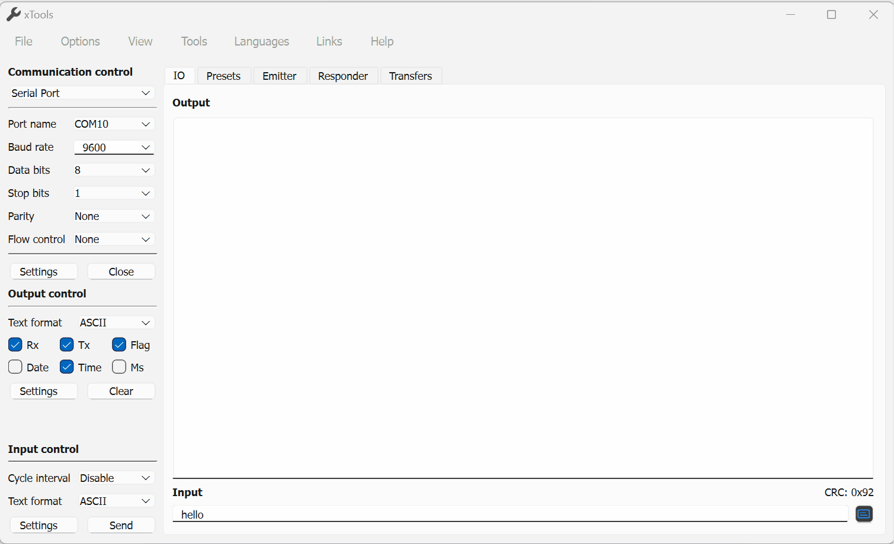
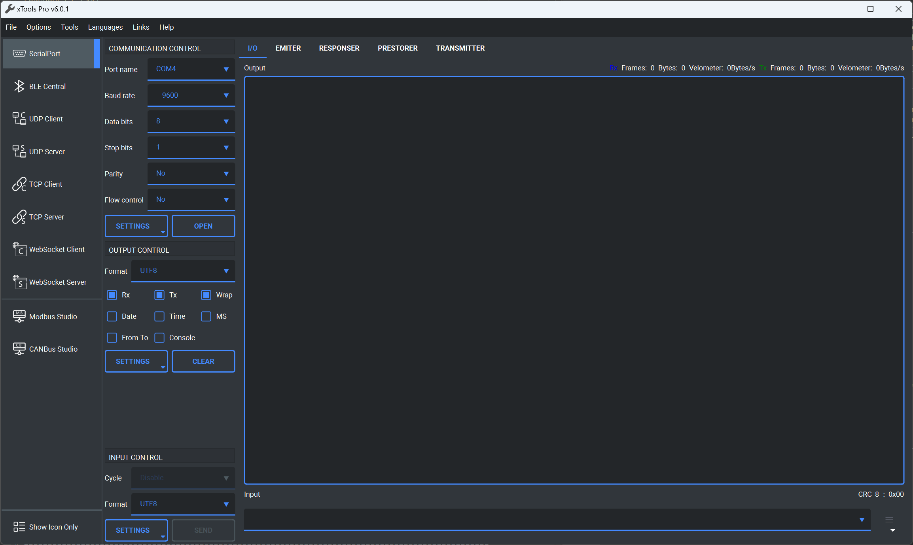
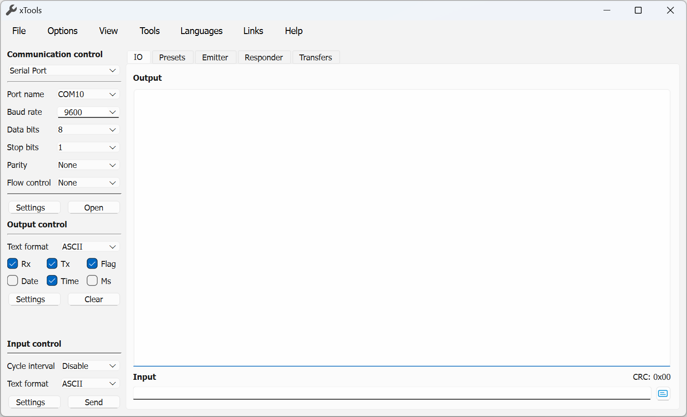

# xTools    

*xTools* is a user-friendly, open-source, cross-platform debugging tool-set based on Qt (Qt6.8 is recommended). It offers extensive support for SerialPort, BLE, UDP, TCP, Web Socket, Modbus and CAN Bus debugging functionalities.

> **You can get *xTools* form [Micorsoft Store(Pro)](https://www.microsoft.com/store/apps/9P29H1NDNKBB)** or from [Github Release(community)](https://github.com/x-tools-author/x-tools/releases).

> **You can get *xTools* form [Micorsoft Store(Pro)](https://www.microsoft.com/store/apps/9P29H1NDNKBB)** or from [Github Release(community)](https://github.com/x-tools-author/x-tools/releases).

> **You can get *xTools* form [Micorsoft Store(Pro)](https://www.microsoft.com/store/apps/9P29H1NDNKBB)** or from [Github Release(community)](https://github.com/x-tools-author/x-tools/releases).

## About the Project

<!--https://sdpro.top/blog/html/article/1016.html-->

| | |
|---|---|
|Author|x-tools-author|
|E-mail|<x-tools@outlook.com>|
|User Communication| 952218522 (QQ Group)|
|Qt Technology Communication|723516989 (QQ Group)|
|Gitee| <https://gitee.com/x-tools-author/x-tools>|
|GitHub| <https://github.com/x-tools-author/x-tools>|
|More tools|<https://apps.microsoft.com/search/publisher?name=Qsaker2018>|