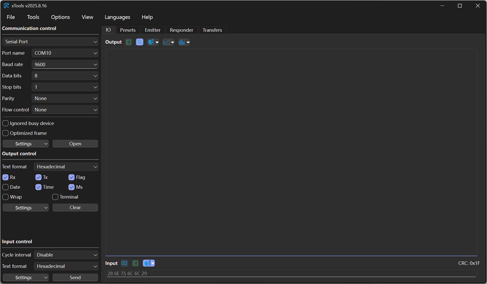
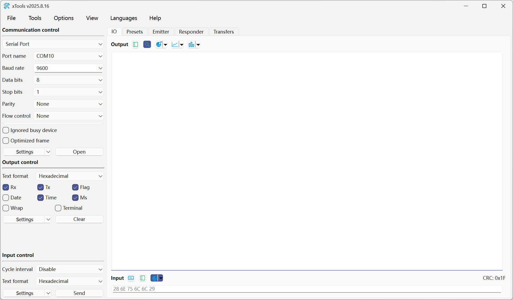
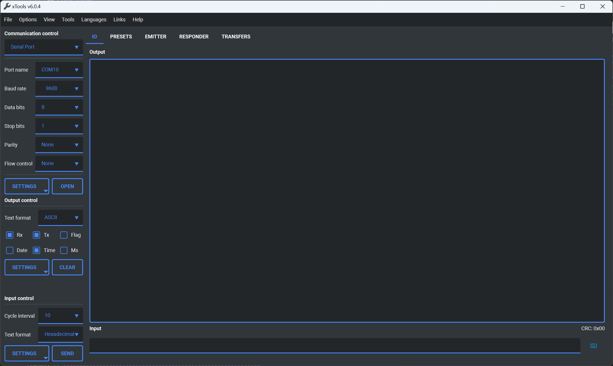

# xTools [](https://www.gnu.org/licenses/lgpl-3.0.html)   [](https://www.microsoft.com/store/apps/9P29H1NDNKBB)

[](https://github.com/x-tools-author/x-tools/actions/workflows/build-windows.yml)
[](https://github.com/x-tools-author/x-tools/actions/workflows/build-ubuntu.yml)
[](https://github.com/x-tools-author/x-tools/actions/workflows/build-macos.yml)
[](https://github.com/x-tools-author/x-tools/actions/workflows/build-android.yml)

[](https://repology.org/project/x-tools/versions)

*xTools* is a user-friendly, open-source, cross-platform debugging tool-set based on Qt (Qt6.8 is recommended). It offers extensive support for serial port, BLE, UDP, TCP, web socket, Modbus and CAN Bus debugging functionalities.

> **You can get *xTools* form [Micorsoft Store(sponsor)](https://www.microsoft.com/store/apps/9P29H1NDNKBB)** or from [Github Release(community)](https://github.com/x-tools-author/x-tools/releases).


## Dark theme



## Light theme



## Custom theme



## Build

### Arch Linux

Arch Linux can install x-tools via the [AUR](https://aur.archlinux.org/packages/x-tools) or a [self-built source](https://github.com/taotieren/aur-repo).

```bash
yay -Syu x-tools
```

## About the Project

<!--https://sdpro.top/blog/html/article/1016.html-->
[](https://img.shields.io/github/stars/x-tools-author/x-tools?style=social)
[](https://img.shields.io/github/forks/x-tools-author/x-tools?style=social)
[](https://img.shields.io/github/watchers/x-tools-author/x-tools?style=social)
[](https://gitee.com/x-tools-author/x-tools/stargazers)
[](https://gitee.com/x-tools-author/x-tools/members)

|Option|Description|
|---|---|
|Author|x-tools-author|
|E-mail|<x-tools@outlook.com>|
|User Communication| 952218522 (QQ Group)|
|Qt Technology Communication|723516989 (QQ Group)|
|Gitee| <https://gitee.com/x-tools-author/x-tools>|
|GitHub| <https://github.com/x-tools-author/x-tools>|
|Sponsor|<https://apps.microsoft.com/search/publisher?name=x-tools-author>|
|Third party|[glog](https://github.com/google/glog) [libqrencode](https://github.com/fukuchi/libqrencode) [qmdnsengine](https://github.com/nitroshare/qmdnsengine) [Qt-Advanced-Stylesheets](https://github.com/githubuser0xFFFF/Qt-Advanced-Stylesheets) [QXlsx](https://github.com/QtExcel/QXlsx)|
