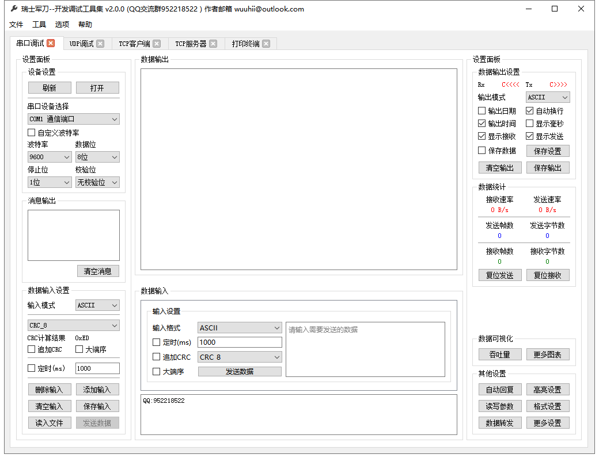

# Swiss Army Knife


|Workflows|\[build platform\]-\[target-platform\]-\[qt version\]\(_edition\)|
|----|----|
|build-windows-msvc|windows2019-windows-qt5.9.9_msvc2017_64</br>windows2019-windows-qt5.12.10_msvc2017</br>windows2019-windows-qt5.12.10_msvc2017_64</br>windows2019-windows-qt5.15.2_msvc2019</br>windows2019-windows-qt5.15.2_msvc2019_64|
|build-windows-mingw|windows2019-windows-qt5.12.10_mingw73_64</br> windows2019-windows-qt5.15.2_mingw81_64|
|build-ubuntu|ubuntu18.04-linux-qt5.9.5</br>ubuntu20.04-linux-qt5.12.8|
|build-macos|macos10.15-macos-qt5.9.9</br>macos10.15-macos-qt5.12.10</br>macos10.15-macos-qt5.15.2|
|build-ios|macos10.15-ios-qt5.12.10</br>macos10.15-ios-qt5.15.2|
|build-android|ubuntu18.04-android_x86-qt5.12.10</br>ubuntu18.04-android_armv7-qt5.12.10</br>ubuntu18.04-android_arm64_v8a-qt5.12.10|

[中文](./doc/zh_CN/README.md)
***************

## How to Build the Project

### Method 1 (for Windows, Linux and macOS)

1. Download Qt Install it.
2. Using QtCreator to open the QtSwissArmyKnife.pro file and build it.

### Method 2 (just for ubuntu)

#### Install the Environment

```(shell)
sudo apt-get update --fix-missing -y
sudo apt-get install gcc g++ -y
sudo apt-get install make git -y
sudo apt-get install libgl1-mesa-dev -y
sudo apt-get install qt5-default -y
sudo apt-get install libqt5websockets5 libqt5websockets5-dev -y
sudo apt-get install libqt5serialport5 libqt5serialport5-dev -y
sudo apt-get install libqt5charts5 libqt5charts5-dev -y
```

Note: QCharts module can not be identified when building from command line.

#### Build the Project

From github:

```(shell)
git clone https://github.com/qsaker/QtSwissArmyKnife.git
```

or from git gitee:

```(shell)
git clone https://gitee.com/qsaker/QtSwissArmyKnife.git
```

If you want to using more function, maybe you should do these:

```(shell)
git submodule update --init --recursive
```

Build the project:

```(shell)
cd QtSwissArmyKnife
qmake
make
```

## Recommended Development Environment

Qt 5.15.x, other versions may be available, you can have a try.

## Have a Look



## About the Project

* Author：Qter
* E-mail：qsaker@qq.com
* User Communication: 952218522 (QQ Group)
* Qt Technology Communication：723516989 (QQ Group)
* Gitee: <https://gitee.com/qsaker/QtSwissArmyKnife>
* GitHub: <https://github.com/qsaker/QtSwissArmyKnife>

***************

```txt
   ____  __
  / __ \/ /____  _____
 / / / / __/ _ \/ ___/
/ /_/ / /_/  __/ /
\___\_\__/\___/_/

```
