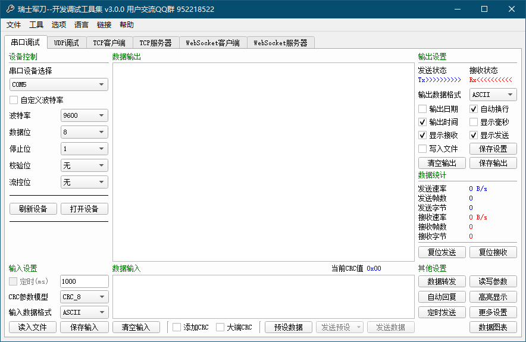

# “瑞士军刀”

[English](../../README.md)  
***************
QSAK（Qt Swiss Army Knife）是一款基于Qt开源框架打造的多功能、跨平台调试工具。它集串口调试、网口调试、蓝牙调试、USB调试、HID调试、CAN总线调试、MODBUS总线调试等调试功能于一身，具备MAVLink、MODBUS、MQTT等通信协议的解释调试能力，能够运行在Windows、Linux、macOS、ios、Android及Raspberry Pi等设备上。**项目的目标是打造软件版“瑞士军刀”。**

## 开发环境

Qt 5.15.x，其他版本也可能适用，但项目作者不会对其他版本开发时遇到的问题进行修复。

## 主界面预览



## 关于项目

* 作者：wuuhii
* 邮箱：wuuhii@outlook.com
* 官网：<https://www.qsak.pro/>
* 交流：952218522 （用户交流群）
* 交流：723516989 （Qt技术交流群）

***************

```txt
                _           _
               | |         (_)
__      ___   _| |__   __ _ _
\ \ /\ / / | | | '_ \ / _` | |    sheng huo bu zhi yan qian de gou qie, hai you yuan fang de gou qie.
 \ V  V /| |_| | | | | (_| | |           but do not be upset, coding will make you happy.
  \_/\_/  \__,_|_| |_|\__,_|_|                                                               --Confucius
```
