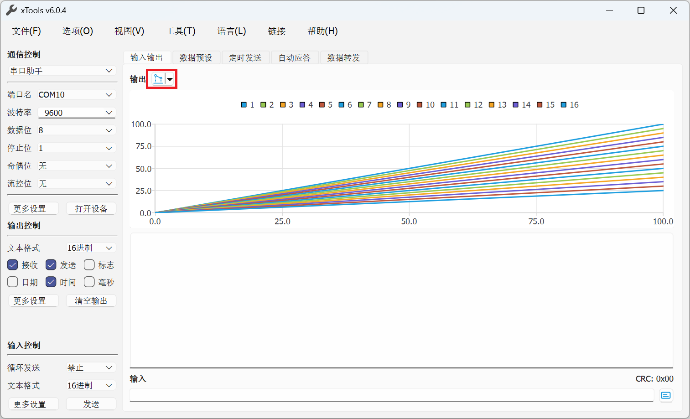
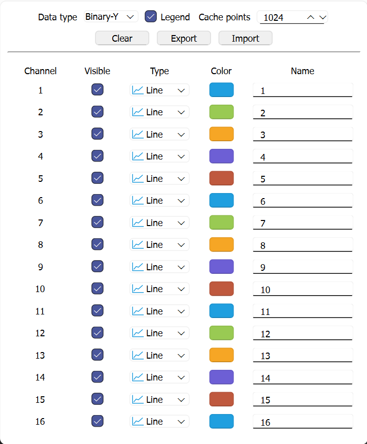

# xTools 用户手册

xTools是一款基于Qt开发的跨平台的开源串口，网口，蓝牙等调试工具。支持串口，UDP客户端，UDP服务器，TCP客户端，TCP服务器，WebSocket客户端，WebSocket服务器等的数据收发调试。

## 通信控制

### 串口通信

### UDP客户端

### UDP服务器

### TCP客户端

### TCP服务器

### WebSocket客户端

### WebSocket服务器

### 数据持久化

## 输出控制

## 输入控制

### 数据预设

### 定时发送

### 自动应答

## 图表模块

图表模块可以将接收到的数据转换为图表，目前支持折线图，曲线图和散点图三种显示方式。用户可以点击图表按钮（上图中红色框选按钮）来显示/隐藏图表面板，可以点击图表按钮的下拉菜单调出配置面板进行相关配置。

