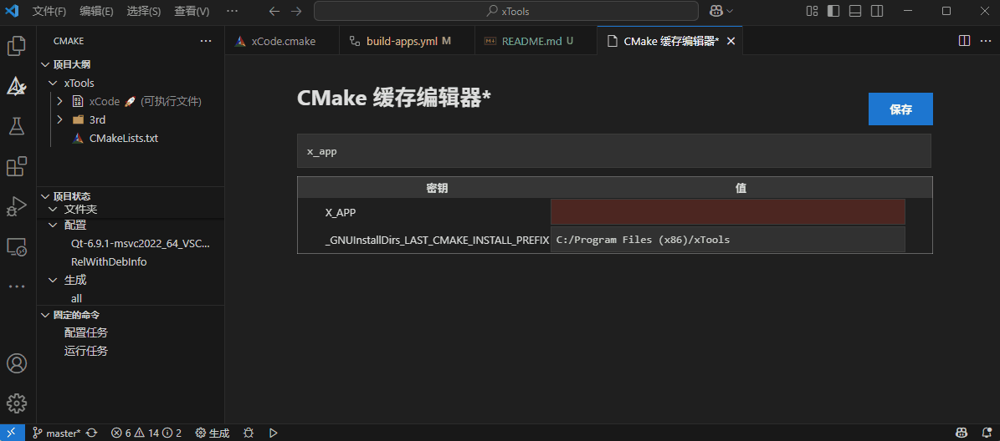

# xApps

> Qt 6.8 is supported only. Other versions maybe work, but not tested.

## xApps List

| xApp | Description |
| ---- | ----------- |
| `xAssistant` | Just a simple xTools |
| `xCode` | A Barcode and QR code generator |
| `xDebug` | A simple xTools with modern ui |
| `xOscilloscope` | A serial port oscilloscope |
| `xPing` | A ping tool, which can scan host by pinging |
| `xProtocol` | A general tool for data reading and writing with custom protocol |
| `xSvg` | A svg tool, which can change svg size color and so on |

## How to Build

You can set the `X_APP` value to build a specific xApp.

