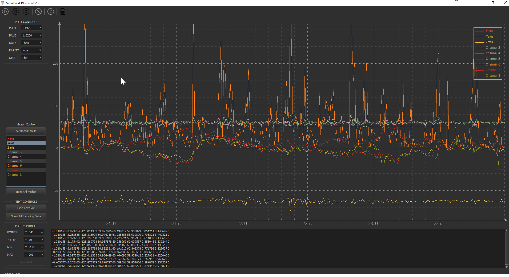

# Serial Port Plotter

This is a Windows application that displays real time data from serial port. The application is 32-bit and built with Qt and QCustomPlot library.

## Features

- No axes limit: An unknown/new channel data create a new graph and uses it (palette of 14 cyclic colors)
- No data point limit: All received data is kept so user can explore old data
- No baud rate limit: Tested up to 912600 bps
- Zooming and dragging using the mouse (wheel or click, restricted to X axis only)
- Moving around the plot displays the X and Y values of the graph in the status bar
- Channel's name legend (double-click to modify)
- Channel selection (click on legend's text)
- Supports positive and negative integers and floats
- Exports to PNG
- Exports to CSV
- Autoscale to visible graph

## Screenshot



## How to use the application

Just send your integer data over the serial port. The application expects certain format so it can differentiate between values. Each message you send must start with '$' and end with ';' (semi-colon) and the integers inside need to be space-separated. The Help button displays comprehensive instructions.

Use the mouse wheel over controls to change its values and use it over plot area to zoom.

When stopped/paused, plot area can be dragged and file saving can be enabled.

To enable the file saving, click on the document button before starting the plot.

Double click on a channel in the Graph Control panel to hide/show a specific channel.


## Send data over the serial port

```c
/* Example: Plot two values */
printf ("$%d %d;", data1, data2);
```

Depending on how much data you want to display, you can adjust the number of data points. For example, if you send data from the serial port of the mbed every 10 ms (100 Hz) and the plotter is set to display 500 points, it will contain information for 5 seconds of data.

The software supports integer and decimal numbers ( float/double )

## Source

Source and .pro file of the Qt Project are available. A standalone .exe is included for the people who do not want to build the source. Search for it at [releases](https://github.com/CieNTi/serial_port_plotter/releases)

## Credits

- [Serial Port Plotter at mbed forums](https://developer.mbed.org/users/borislav/notebook/serial-port-plotter/) by [Borislav K](https://developer.mbed.org/users/borislav/)
- [Line Icon Set](http://www.flaticon.com/packs/line-icon-set) by [Situ Herrera](http://www.flaticon.com/authors/situ-herrera) icon pack
- [Lynny](http://www.1001freedownloads.com/free-vector/lynny-icons-full) icon pack
- [Changelog](http://keepachangelog.com/)
- Base of this software by [CieNTi](https://github.com/CieNTi)
- CSV export by [HackInventOrg](https://github.com/HackInventOrg)

## Changelog

All notable changes to this project will be documented below this line.
This project adheres to [Semantic Versioning](http://semver.org/).

## [1.3.0] - 2018-08-01

### Info

- Built with QT 5.11.1
- QT libraries updated and new plot features implemented
- Beginning of version 1.3

### Added

- COM port refresh button to update the list
- Channel visibility control added to turn off unwanted channel
- Autoscale button for Y axis will autoscale to the highest value + 10%
- Save to CSV support

### Changed

- qDarkStyle updated to 2.5.4
- qCustomplot updated 2.0.1

### Bugfix

- Axis rename dialog gets focus when popup occurs

## [1.2.2] - 2018-07-26

### Info

- Project forked from HackInvent since 1.2.1

### Added

- UART debug textBox
- Textbox control ( toggle visible and toggle data filter )

## [1.2.1] - 2017-09-24

### Fixed

- Support for float/double has been added
- Linux build fails because no `serial_port_plotter_res.o` file was found (Issue #4)

## [1.2.0] - 2016-08-28

### Added

- Negative numbers support ([cap we](https://developer.mbed.org/users/capwe/) FIX at [mbed forums](https://developer.mbed.org/comments/perm/22672/))
- Support for high baud rates (tested up to 912600 bps)

## [1.1.0] - 2016-08-28

### Added

- Original qdarkstyle resources (icons are working now)
- Manifest and all Windows related/recommended configs
- *Line Icon Set* icons in 3 colors
- *Lynny* icons in 3 colors
- Inno Setup file with auto-pack .bat file (installer tested on WinXP-32b and Win10-64b)
- Play/Pause/Stop, Clear and Help toolbar buttons

### Changed

- Resources structure
- Updated qcustomplot to v1.3.2
- Menubar is replaced by icon toolbar for usability
- [WiP] mainwindow.cpp doxygen friendly comments

### Removed

- Control over number of points
- Delete previous graph data
- *Connect* and *Start/Stop plot* buttons

## [1.0.0] - 2014-08-31

### Added

- Original [Borislav Kereziev](mailto:b.kereziev@gmail.com) work commit [source](https://developer.mbed.org/users/borislav/notebook/serial-port-plotter/)


## To-Do

- Port list refresh
- Fill baud automatically and allow custom by textbox (when COM ui)
- PNG *WITH* transparency
- Separate `receive_data` from `process_data` to allow non-throttled operations

[1.3.0]: https://github.com/Eriobis/serial_port_plotter/releases/tag/v1.3.0
[1.2.2]: https://github.com/Eriobis/serial_port_plotter/releases/tag/v1.2.2
[1.2.0]: https://github.com/CieNTi/serial_port_plotter/releases/tag/v1.2.0
[1.1.0]: https://github.com/CieNTi/serial_port_plotter/releases/tag/v1.1.0
[1.0.0]: https://github.com/CieNTi/serial_port_plotter/releases/tag/v1.0.0
